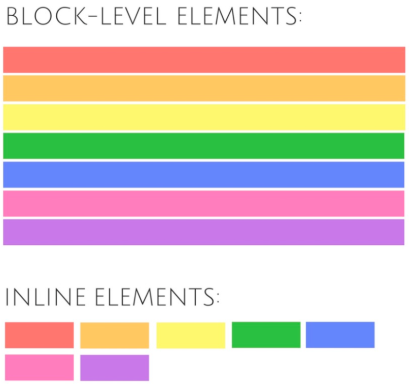
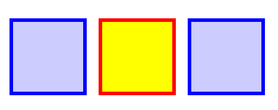
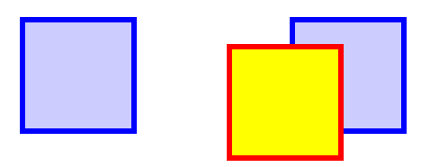
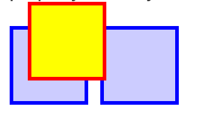
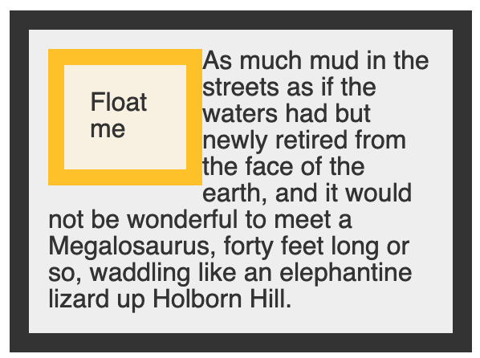
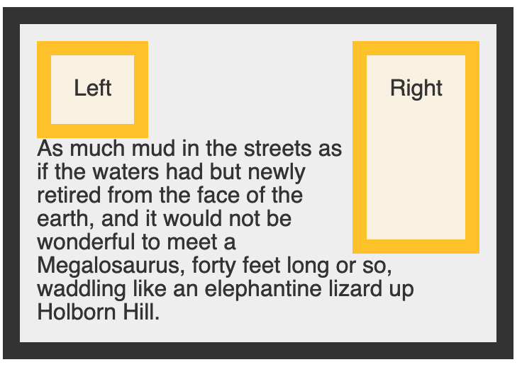

# Web Development I Cheatsheet (SEM I)

# 1. Basis HTML

## 1.1 Attribute tag

---

> Attributen geven extra informatie over een element (naam + waarde)

> In onderstaand voorbeeld is **href** een attribuut.

```HTML
<a href="https://google.com/">Klikbaar element</a>
```

<br/>

## 1.2 Block level vs inline

---

> **Block-elementen** nemen heel de paginabreedte in

> **Inline-elementen** komen na elkaar



<br/></br>

## 1.2 Soorten secties

---

> Sinds HTML5 kunnen we verschillende inhoudsblokken makkelijk definiëren met tags. We onderscheiden:

```HTML
<header> <!-- Dit gebruiken we voor de hoofding-->
<nav> <!-- Dit gebruiken  we voor de navigatiebalk-->
<main> <!-- Dit gebruiken we voor de main content op je website-->
<article> <!-- Dit gebruiken we voor bepaalde herhalende elementen, zoals artikels bij een perswebsite-->
<aside> <!-- Dit gebruiken we als sidebar (zowel links als rechts)-->
<footer> <!-- Dit gebruiken we vanonder aan de website bij een footer-->
<section> <!-- Voor een onderdeel van een pagina-->
```

<br/>

## 1.3 Hoofdingen

---

> Om titels en ondertitels te maken, maken we gebruik van de `<h>` tag.

> Deze bestaan van `<h1>` tot en met `<h6>`.

> Door er het `id` attribuut aan toe te voegen kunnen we hier een ankerpunt van maken.

> **Let op:** dit is enkel voor titels. Onderliggende teksten markeren we met de `<p>` tag.

```HTML
<h1 id="hoofding1">Dit is een titel</h1>
<p>Dit is onderliggende tekst</p>
```

<br/>

## 1.4 Regeleinde

---

> Witruimte, regeleinde en tabs worden niet weergegeven in een browser. Daarom gebruiken we de `<br/>` tag om regels af te breken.

```HTML
<p>Dit is een<br/>regeleinde.</p>
```

<br/>

## 1.5 Speciale opmaaktags

---

> Hieronder vind je een lijst van de <cite>meest</cite> belangrijke tags

```HTML
<em> <!-- Klemtoon leggen, standaard cursief (emphasis)-->
<strong> <!-- Nadruk leggen, heel belangrijk, standaard vet-->
<small> <!--Aanvullende informatie-->
<cite> <!-- Citeren van de naam van een auteur (!NIET  VOOR BRONVERMELDING)-->
<q> <!-- Korte citaten in lopende zin-->
<abbr> <!--Afkortingen weergeven, in combinatie met title tag-->
<dfn> <!-- Markeert eerste keer dat definitie voorkomt-->
<code> <!-- Markeren van programmacode-->
<span> <!-- Een containerelement zonder betekenis, met mogelijke attirbuten-->
<pre> <!-- Behouden van tabs, witruimte, etc in code-->
<sub> <!-- Subscrips, bijvoorbeeld de 2 van H2O kleiner weergeven-->
<sup> <!-- Tegenovergestelde van sub-->
<s> <!--Strikethrough-->
<ins> <!-- Toegevoegde inhoud, zoals op Github (groene highlight)-->
<del> <!-- Verwijderde inhoud, zoals op Github (rode highlight)-->
<mark> <!--Markeren van tekst met 'fluostift'-->
<kbd> <!-- Gebruikersinvoermarkering-->
<samp> <!-- Computeruitvoer-->
```

<br/>

## 1.6 Inhoud groeperen

---

> We kunnen inhoud groeperen zoals adresgegevens, opsommingslijsten,...

### 1.6.1 Gegevens

> De `<address>` tag gebruiken we voor contactinformatie.

> De `<main>` tag gebruiken om de belangrijkste informatie te markeren (niet header, footer en navigatie).

> De `<blockquote>` tag gebruiken we voor langere citaten uit andere bron waarbij bron wordt vermeld met `cite` attribuut.

<br/>

### 1.6.2 Lijsten

> We gebruiken de `<ol>` tag voor een ordered list (met nummers). Dit altijd in combinatie met `<li>` tag (dit is om het lijstelement zelf te plaatsen).

<ol>
    <li>Item 1</li>
    <li>Item 2</li>
    <li>Item 3</li>
</ol>

```HTML
<ol>
    <li>Item 1</li>
    <li>Item 2</li>
    <li>Item 3</li>
</ol>
```

> We gebruiken de `<ul>`tag voor een niet ordered list (puntjes). Dit is eveneens in combinatie met de `<li>` tag.

<ul>
    <li>Item 1</li>
    <li>Item 2</li>
    <li>Item 3</li>
</ul>

```HTML
<ul>
    <li>Item 1</li>
    <li>Item 2</li>
    <li>Item 3</li>
</ul>
```

> We gebruiken `<dl>` in combinatie met `<dt>` en `<dd>` voor een gepaarde lijst.

<dl>
    <dt>Hoofding</dt>
    <dd>Beschrijving</dd>
</dl>

```HTML
<dl>
    <dt>Hoofding</dt>
    <dd>Beschrijving</dd>
</dl>
```

> Lists kunnen ook genest worden.

<br/>

### 1.6.3 Illustraties en bijschiften

> We gebruiken de `<figure>` tag om illustraties met bijschrift te groeperen. Dit kan ook een tabel, grafiek, citaat of meer zijn. Dit in combinatie met `<figcaption>`.

```HTML
<figure>
    
    <figcaption>An elephant at sunset</figcaption>
</figure>
```

<br/>

### 1.6.4 Makkelijk benaderen met opmaak en scripting

> Voor dit gebruiken we de `<div>` tag. In combinatie met het `class` attribuut kan je vanuit een CSS bestand de div tag makkelijk benaderen.

```HTML
<div class="voorbeeldclass">
    <p>Dit is een voorbeeldparagraaf</p>
</div>
```

```CSS
.voorbeeldclass {
    margin: 1rem;
    border: 1px;
}
```

<br/>

## 1.7 Koppelingen

---

### 1.7.1 Links

> Het gebruik van hyperlinks in HTML maakt het mogelijk om van de ene webpagina naar een andere te gaan. Dit kan binnen de website zijn, buiten, e-mail clients, telefoonnummer bellen,...

> We maken iets klikbaar met de `<a>` tag. Dit kan een kop, tekst, afbeelding,... zijn.

```HTML
<a href="https://google.com">Dit is klikbare tekst</a>
```

> Bij lokale links navigeren we door de mappen met `/` en om een niveau te stijgen gebruiken we `../`.

> Bij een link naar een e-mail adres gebruiken we `mailto:` en voor telefoneren gebruiken we `tel:`.

> Door `target:"_blank"` te gebruiken kunnen we de URL openen in een nieuw tabblad.

> Je kan als target ook een ankerpunt van een titel gebruiken.

```HTML
<a href="#hoofding1">Spring naar hoofding 1!</a>

<a href="/overons.html#hoofding1">Spring naar hoofding 1 op over ons!</a>
```

### 1.7.2 Bestanden linken (stylesheets)

> Om CSS te gebruiken in ons document moeten we de stylesheet linken aan onze HTML pagina. Dit doen we met onderstaande code.

```HTML
<link rel="stylesheet" href="main.css">
```

> Je kan ook het siteicoon veranderen met:

```HTML
<link rel="icon" href="favicon.ico" type="image/x-icon">
```

<br/>

## 1.8 Afbeeldingen

---

> We kunnen een afbeeldingen weergeven met de `` tag. Dit altijd in combinatie met het `src` attribuut. Het `alt` attribuut is een tekst wanneer de afbeelding niet zichtbaar zou zijn. Met `width` en `height` kan je de afmetingen doorgeven. De browser weet dan wat er komt. NIET OM TE SCHALEN!

```HTML

```

> Omdat sommige beeldschermen een hele hoge pixeldensity hebben (denk maar aan Retina), kan het zijn dat je soms een betere versie van een afbeelding wilt inladen. De browser kan op zijn beurt verschillende resoluties inladen voor het geschikte beeldscherm. Dit gebeurt met het `srcset` attribuut.

```HTML

```

<a href="https://developer.mozilla.org/en-US/docs/Web/HTML/Element/video">HTML video</a>
<br/>
<a href="https://developer.mozilla.org/en-US/docs/Web/HTML/Element/audio">HTML audio</a>

<br/>

## 1.9 <a href="https://developer.mozilla.org/en-US/docs/Web/HTML/Element/table">Tabellen</a>

---

> Iedere tabel start met de root tag `<table>`. Daaronder komen rijen met de `<tr>` tag en daarin kolommen met de `<td>` tag (je definiëert dus per rij, kolommen).

<table>
    <thead>
        <tr>
        <th>Header</th>
        </tr>
    </thead>
    <tr>
        <td >Kolom 1.1</td>
        <td>Kolom 1.2</td>
    </tr>
    <tr>
        <td>Kolom 2.1</td>
        <td>Kolom 2.2</td>
    </tr>
</table>

```HTML
<table>
    <thead>
        <tr>
            <th>Header</th>
        </tr>
    </thead>
    <tr>
        <td>Kolom 1.1</td>
        <td>Kolom 1.2</td>
    </tr>
    <tr>
        <td>Kolom 2.1</td>
        <td>Kolom 2.2</td>
    </tr>
</table>
```

> Door de attributen `rowspan` en `colspan` te gebruiken kan je 1 cel meerdere kolommen of rijden laten overvloeien.

<br/>

<style>
    table, td, th {
        border: 1px solid white;
    }
</style>

<table>
    <tr>
        <td rowspan="2">Kolom 1.1</td>
        <td>Kolom 1.2</td>
    </tr>
    <tr>
        <td>Kolom 2.2</td>
    </tr>
</table>

<br/>

```HTML
<table>
    <tr>
        <td rowspan="2">Kolom 1.1</td>
        <td>Kolom 1.2</td>
    </tr>
    <tr>
        <td>Kolom 2.2</td>
    </tr>
</table>
```

<br/>

## 1.10 [Formulieren](https://developer.mozilla.org/en-US/docs/Web/HTML/Element/form)

---

> Met de `<form>` tag kunnen we een inputformulier maken. Met het attribuut `action` zeggen we naar welke URL het formulier moet gestuurd worden. Met het attribuut `method` zeggen we de methode van versturen. Dit of `get` (toevoegen aan url) of `post` (toevoegen aan header van HTTP request).

<br/>

<form action="" method="get" class="form-example">
  <div class="form-example">
    <label for="name">Enter your name: </label>
    <input type="text" name="name" id="name" required>
  </div>
  <div class="form-example">
    <label for="email">Enter your email: </label>
    <input type="email" name="email" id="email" required>
  </div>
  <div class="form-example">
    <input type="submit" value="Subscribe!">
  </div>
</form>

<br/>

> Ieder veld stoppen we in een `div` element. Om de tekst voor het veld te krijgen, gebruiken we `label` met daarin een link naar het inputveld met `for` (met het `id` van het `input` veld).

```HTML
<form action="" method="get">

  <div>
    <label for="name">Enter your name: </label>
    <input type="text" name="name" id="name" required>
  </div>

  <div>
    <label for="email">Enter your email: </label>
    <input type="email" name="email" id="email" required>
  </div>

  <div>
    <input type="submit" value="Subscribe!">
  </div>

</form>
```

> Je kan ook de `<label>` tag rond de `<input>` tag zetten.

```HTML
<div>
    <label>Enter your name
        <input type="text" name="name" required>
    </label>
</div>
```

> Bij de [`<input>`](https://developer.mozilla.org/en-US/docs/Web/HTML/Element/input) tag zijn er een paar attributen
> <br/>- `id` in combinatie met label of voor css
> <br/>- `name` nodig voor het versturen van het formulier
> <br/>- `value` waarde van een invoerveld als de gebruiker zelf niets ingeeft
> <br/>- `placeholder` voor helptekst.
> <br/> **We kunnen ook de invoer client-side valideren met:** <br/>- `required` verplichte infvoer
> <br/>- `minlenght` en `maxlenght` min- en max lengte van de invoer
> <br/>- `size` lengte van het invoerveld
> <br/>- `pattern` een regex patroon
> <br/>**Gebruikersbeperkingen:** <br/>- `readonly` veld kan niet worden aangepast, enkel getoond
> <br/>- `disabled` veld is uitgeschakeld

> Voor de `<input>` tag hebben we ook het `type` attribuut. <br/>
> Op Mozilla MDN vinden we hier een [hele lijst](https://developer.mozilla.org/en-US/docs/Web/HTML/Element/input#%3Cinput%3E_types) van.

> Er zijn nog een paar overige elementen die op een andere manier geïmplementeerd worden.
> <br/>- [`<button>`](https://developer.mozilla.org/en-US/docs/Web/HTML/Element/button): knop
> <br/>- [`<textarea>`](https://developer.mozilla.org/en-US/docs/Web/HTML/Element/textarea): uitgebreide tekstinvoer
> <br/>- [`<option>`](https://developer.mozilla.org/en-US/docs/Web/HTML/Element/select): keuzemogelijkheid
> <br/>- [`<optgroup>`](https://developer.mozilla.org/en-US/docs/Web/HTML/Element/optgroup): groeperen van keuzemogelijkheden
> <br/>- [`<select>`](https://developer.mozilla.org/en-US/docs/Web/HTML/Element/select): keuzelijst
> <br/>- [`<datalist>`](https://developer.mozilla.org/en-US/docs/Web/HTML/Element/datalist): keuzelijst met invoervak

 <br/>

# 2. [CSS](https://developer.mozilla.org/en-US/docs/Web/CSS/Reference)

## 2.1 De plaatsing van CSS

---

> We kunnen CSS op verschillende manieren implementeren.
> <br/>- In een external stylesheet met `<link rel="stylesheet" href="css/stijlen.css">`.
> <br/>- In het HTML document zelf met de `<style>` tag.
> <br/>- Als inline element in de begin tag van het element. Bv. `<p style="font-family:'Courier New'; font-size: 20px;">Test</p>`

> We kunnen andere stijlbladen importeren met `@import url('bestand.css')`.

> Browsers hebben hun eigen standaard stylesheet. Soms kan dit voor inconsistenties zorgen tussen browsers. Hiervoor gebruiken we een [browser reset stylesheet](https://necolas.github.io/normalize.css/).

<br/>

## 2.2 [CSS eenheden](https://developer.mozilla.org/en-US/docs/Learn/CSS/Building_blocks/Values_and_units)

---

> CSS heeft verschillende eenheden. Hieronder een korte opsomming.
> <br/> **Absolute eenheden** <br/>- `px`: CSS pixel, optische referentie-eenheid
> <br/>**Relatieve eenheden** <br/>- `em`: gelijk aan de berekende tekstgrootte van het ouderelement
> <br/>- `rem`: de tekstgrootte van het rootelement
> <br/>- `ch`: breedte van tekst
> <br/> **Viewport percentages** <br/>- `vw`: 1% van de breedte van het venster
> <br/>- `vh`: 1% van de hoogte van het venster
> <br/>- `vmin`: de kleinste waarde van vh en vw
> <br/>- `vmax`: de grootste waarde van vh en vw

<br/>

## 2.3 Verwerking van CSS door de browser

---

> Als er meerdere waarden zijn toegewezen aan een property, zal de browser de meest specifieke kiezen. In het onderstaande geval zal de kleur dus rood zijn.

```CSS
body > div {
    background-color: red;
}

div {
    background-color: black;
}

* {
    background-color: green;
}
```

> In onderstaande tabel zien we wat belangrijker is. Hoe meer naar rechts, hoe minder belangrijk. Het helemaal linkse getal is inline style.

| Selector         | Specificiteit | Toelichting                                        |
| ---------------- | ------------- | -------------------------------------------------- |
| div ul ul li     | 0,0,0,4       | 4 elementselectors                                 |
| div.klasse ul li | 0,0,1,3       | 1 klasseselector, 3 elementselectors               |
| a::before        | 0,0,0,2       | 1 pseudoklasse, 1 elementselector                  |
| a.klasse:hover   | 0,0,2,1       | 1 klasse, 1 pseudoklasse, 1 elementselector        |
| p.eerste         | 0,0,1,1       | 1 klasseselector, 1 elementselector                |
| #id p.eerste     | 0,1,1,1       | 1 id-selector, 1 klasseselector, 1 elementselector |

<br/>

> Volgorde van gebruikte stijlbladen (naar belangrijkheid):
>
> - Declaraties in de browser
> - Declaraties van de gebruiker
> - Declaraties van de auteur
> - Declaraties van de auteur met kenmerk `!important`
> - Declaraties van de gebruiker met kenmerk `!important`

<br/>

## 2.4 Overerving

---

> Een opmaakeigenschap hoeft niet rechtstreeks een waarde te krijgen. De waarde kan overgeerfd worden van het ouderelement.

> Zonder de onderstaande CSS zal de `<em>` tag de tekst gewoon cursief maken (overerving van een ouderelement). Als we de onderstaande CSS dan wel gebruiken, zal hij de tekst tussen de `<em>` tags ook blauw maken.

```CSS
em {color:blue;}
```

```HTML
<p>Hey, <em>look</em> at that sheepdog</p>
```

> **Opgelet**: Eigenschappen zoals padding, width, height, background-color, border,... zijn niet erfelijk. Je kan dit toch forceren door `inherit` mee te geven.

```CSS
h2 { color: inherit; }
```

> **Welke properties worden overgeërfd?** <br/>
>
> - Tekst-gerelateerde properties <br/> `font-family`, `font-size`, `font-style`, `font-variant`, `font-weight`, `font`, `letter-spacing`, `line-height`, `text-align`, `text-indent`, `tekst-transform`, `word-spacing`
> - List-gerelateerde properties <br/> `list-style-image`, `list-style-position`, `list-style-type`, `list-style`
> - Kleuren <br/> `color`

<br/>

## 2.5 [Selectors](https://developer.mozilla.org/en-US/docs/Web/CSS/CSS_Selectors)

---

### 2.5.1 Basisselectors

---

> **Basisselector (A)**<br/>
> Ieder `<p>` element zal groen kleuren.

```CSS
p {
  color: green;
}
```

> **Klassenselector (.A)**<br/>
> Ieder element met `class="klasse1"` als attribuut zal zwart kleuren. <br/>
> Ieder `<span>` element in een ander element met `class="klasse1` als attribuut kleurt rood. <br/>
> Bij het laatste voorbeeld zal ieder `<span>` element met het klasseattribuut `class=klasse1` rood kleuren.

```CSS
.klasse1 {
  color: black;
}

.klasse1 span {
  color: red;
}

span.klasse1 {
  color: red;
}
```

> **ID Selector (#A)**<br/>
> Ieder element met `id="uniekid1"` als attribuut zal aqua kleuren.

> ID's zijn altijd uniek en worden bij maar 1 element gebruikt!

```CSS
#uniekid1 {
  color: aqua;
}
```

### 2.5.2 Combinatieselectors

---

> **Combinatieselector (A>B)** <br/>
> Ieder `<p>` element waarvan de rechtstreekse parent een `<div>` element is zal blauw kleuren.

```CSS
div > p {
  color: blue;
}
```

> **Combinatieselector (A B)** <br/>
> Ieder `<p>` element dat een afstammeling is van `<div>` (kind, kleinkind,...) kleurt paars.

```CSS
div p {
  color: purple;
}
```

> **Combinatieselector (A+B)** <br/>
> Ieder `<p>` element, op hetzelfde nivau als `<div>` en dat onmiddelijk op `<div>` volgt kleurt geel.

```CSS
div+p {
  color: yellow;
}
```

> **Combinatieselector (A~B)** <br/>
> Ieder `<p>` element, op hetzelfde nivau als `<div>` en dat op `<div>` volgt kleurt groen (moet niet onmiddelijk).

```CSS
div~p {
  color: green;
}
```

> **Combinatieselector (A,B)** <br/>
> Ieder `<p>` en `<div>` element kleurt oranje. Op welk niveau dan ook.

```CSS
div,p {
  color: orange;
}
```

> **Combinatieselector (A,B)** <br/>
> Ieder `<p>` en `<div>` element kleurt oranje. Op welk niveau dan ook.

```CSS
div,p {
  color: orange;
}
```

### 2.5.3 Attribuutselectors

---

| Teken | Beschrijving              | Voorbeeld            | Betekenis voorbeeld                                                                    |
| ----- | ------------------------- | -------------------- | -------------------------------------------------------------------------------------- |
|       |                           | img[alt]             | elk element img met attribuut alt                                                      |
| =     | Exact gelijk aan          | img[alt="foto"]      | elk img element waarvan alt attribuut gelijk aan de waarde foto                        |
| ~=    | Bevat waarde              | img[alt~="fotoboek"] | elk img element waarvan class attribuut meerdere waarden kan hebben waaronder fotoboek |
| \|=   | Begint met waarde         | [hreflang\|="nl"]    | elk element waarvan hreflang attribuut gelijk aan nl, of begint met nl- (nl-NL, nl-BE) |
| ^=    | Begint met exacte waarde  | [name^="keuze"]      | name attribuut begint met het exacte woord "keuze" (bv. keuzevak of keuze2)            |
| $=    | Eindigt met exacte waarde | [href$=".com"]       | href attribuut eindigt op ".com" (bv. google.com)                                      |
| \*=   | Bevat exacte waarde       | [href\*="user"]      | href attribuut bevat het exacte woord "user" (bv. hogent.be/user/jan)                  |

<br/>

### 2.5.4 [Pseudoklassen](https://developer.mozilla.org/en-US/docs/Web/CSS/Pseudo-classes)

---

> Pseudoklassen duiden een toestand van een element aan.

> **Hyperlink pseudoklassen**
>
> - [`a:link`](https://developer.mozilla.org/en-US/docs/Web/CSS/:link) onbezochte link
> - [`a:visited`](https://developer.mozilla.org/en-US/docs/Web/CSS/:visited) bezochte link
> - [`a:hover`](https://developer.mozilla.org/en-US/docs/Web/CSS/:hover) met cursor over gaan
> - [`a:active`](https://developer.mozilla.org/en-US/docs/Web/CSS/:active) actief (weinig gebruikt)

> **UI toestand**
>
> - [`:enabled`](https://developer.mozilla.org/en-US/docs/Web/CSS/:enabled) elementen die beschikbaar zijn
> - [`:disabled`](https://developer.mozilla.org/en-US/docs/Web/CSS/:disabled) elementen die niet beschikbaar zijn
> - [`:checked`](https://developer.mozilla.org/en-US/docs/Web/CSS/:checked) een keuzerondje of selectievakje die is ingeschakeld

> **Varia**
>
> - [`:focus`](https://developer.mozilla.org/en-US/docs/Web/CSS/:focus) element dat focus heeft (handeling gebruiker)
> - [`:target`](https://developer.mozilla.org/en-US/docs/Web/CSS/:target) doel van een element
> - [`:lang()`](https://developer.mozilla.org/en-US/docs/Web/CSS/:lang) taal
> - [`:not()`](https://developer.mozilla.org/en-US/docs/Web/CSS/:not) ontkenning

> **[Structurele pseudoklassen](https://developer.mozilla.org/en-US/docs/Web/CSS/Pseudo-classes#Tree-structural_pseudo-classes)**
>
> - `:root` hoofdelement `<html>`
> - `:first-child` een element dat het eerste child is van zijn parent-element
> - `:last-child` een element dat het laatste child is van zijn parent-element
> - `:only-child` een element waarvan de ouder geen andere child elementen heeft
> - `:first-of-type` het eerste element van dat type
> - `:last-of-type` het laatste element van dat type
> - `:only-of-type` het enige element van dat type
> - `:nth-child(n)` elk zoveelste kindelement
> - `:nth-last-child(n)` nu gerekend vanaf het laatste kind
> - `:nth-of-type(n)` elk zoveelste element van een type
> - `:nth-last-of-type(n)` nu gerekend vanaf laatste element
> - `:empty` leeg element

> **Pseudo elementen** <br/>
> Toegang tot onderdelen van een document waarvoor geen gewone elementen bestaan (bijvoorbeeld voor een URL).
>
> - [`::first-line`](https://developer.mozilla.org/en-US/docs/Web/CSS/::first-line) de eerste regel opgemaakte tekst van een element
> - [`::first-letter`](https://developer.mozilla.org/en-US/docs/Web/CSS/::first-letter) de eerste letter
> - [`::before`](https://developer.mozilla.org/en-US/docs/Web/CSS/::before) voor de inhoud van een element
> - [`::after`](https://developer.mozilla.org/en-US/docs/Web/CSS/::after) na de inhoud van een element
>
> Voorbeeld:

```CSS
/* Add a heart before links */
a::before {
  content: "♥";
}
```

<br/>

## 2.6 [CSS Properties](https://developer.mozilla.org/en-US/docs/Web/CSS/CSS_Properties_Reference)

---

> **Enkele CSS properties**
>
> - [`background`](https://developer.mozilla.org/en-US/docs/Web/CSS/background) achtergrondskleur
> - [`color`](https://developer.mozilla.org/en-US/docs/Web/CSS/color) kleur tekst
> - [`font-family`](https://developer.mozilla.org/en-US/docs/Web/CSS/font-family) het lettertype
> - [`font-size`](https://developer.mozilla.org/en-US/docs/Web/CSS/fontsize) tekstgrootte
> - [`font-weight`](https://developer.mozilla.org/en-US/docs/Web/CSS/font-weight) het gewicht (vetheid) van het lettertype
> - [`line-height`](https://developer.mozilla.org/en-US/docs/Web/CSS/line-height) de regelafstand, hoeveelheid it tussen de regels tekst
> - [`margin-bottom`](https://developer.mozilla.org/en-US/docs/Web/CSS/margin-bottom) (of top/left/right) ruimte tussen de rand van een element en de rand van het parent element of angrenzend element
> - [`padding-bottom`](https://developer.mozilla.org/en-US/docs/Web/CSS/padding) (of top/left/right) de ruimte tussen de inhoud en de rand
> - [`text-align`](https://developer.mozilla.org/en-US/docs/Web/CSS/text-align) uitlijnen van tekst
> - [`text-decoration`](https://developer.mozilla.org/en-US/docs/Web/CSS/text-decoration) lijneffecten
> - [`text-transform`](https://developer.mozilla.org/en-US/docs/Web/CSS/text-transform) omzetten naar kleine/hoofdletters

<br/>

## 2.7 [Boxmodel](https://developer.mozilla.org/en-US/docs/Web/CSS/CSS_Box_Model)

---

> Een HTML-pagina is opgebouwd uit blokken. Deze blokken worden bovenop mekaar geplaatst. Een box bestaat uit `content` (bv. tekst), `padding` (ruimte rond het content) een `border` (de rand rond de `padding`) en de `margin` (ruimte rond de border).

### 2.7.1 Box-sizing

---

> Er zijn 2 mogelijke manieren van [`box-sizing`](https://developer.mozilla.org/en-US/docs/Web/CSS/box-sizing):
>
> - `content-box` <br/>
>   Ingestelde width en height hebben enkel betrekking op de **content**.
> - `border-box` <br/>
>   Ingestelde width en height hebben betrekking op de **content** + **padding** + de **border**.

> Eigenschappen [`width`](https://developer.mozilla.org/en-US/docs/Web/CSS/width) en [`height`](https://developer.mozilla.org/en-US/docs/Web/CSS/height)
>
> - `auto` (standaardwaarde) box is zo groot dat de inhoud erin past
> - `lengte of percentage`
> - `max-content` afmeting van het grootste item in de box
> - `min-content` de kleinst mogelijke afmeting zonder overloop te veroorzaken

> Eigenschappen [`min-width`](https://developer.mozilla.org/en-US/docs/Web/CSS/min-width), [`max-width`](https://developer.mozilla.org/en-US/docs/Web/CSS/max-width), [`min-height`](https://developer.mozilla.org/en-US/docs/Web/CSS/min-height) en [`max-height`](https://developer.mozilla.org/en-US/docs/Web/CSS/max-height). <br/>
> Deze waarden overriden `width` en `height`. <br/>
>
> - `auto` (standaardwaarde) box is zo groot dat de inhoud erin past
> - `none`
> - `lengte of percentage`
> - `max-content` afmeting van het grootste item in de box
> - `min-content` de kleinst mogelijke afmeting zonder overloop te veroorzaken

<br/>

### 2.7.2 Marges

---

> Marges ingesteld worden op 2 manieren:
>
> - [`margin-top`](https://developer.mozilla.org/en-US/docs/Web/CSS/margin-top)[`/right`](https://developer.mozilla.org/en-US/docs/Web/CSS/margin-right)[`/bottom`](https://developer.mozilla.org/en-US/docs/Web/CSS/margin-bottom)[`/left`](https://developer.mozilla.org/en-US/docs/Web/CSS/margin-left)
> - [`margin`](https://developer.mozilla.org/en-US/docs/Web/CSS/margin) (afgekort)

```CSS
/* Apply to all four sides */
margin: 1em;
margin: -3px;

/* vertical | horizontal */
margin: 5% auto;

/* top | horizontal | bottom */
margin: 1em auto 2em;

/* top | right | bottom | left */
margin: 2px 1em 0 auto;
```

> **Opgelet**: Marges worden aan de onder en bovenkant samengevoegd, zodat er geen dubbele marges ontstaan. Wanneer de bottom margin van een element de top margin van een ander element overlapt, is het resultaat **NIET** de som, maar **de grootste margin**.

<br/>

### 2.7.3 Borders

---

> Van een border kunnen we 3 waarden instellen:
>
> - [`border-width`](https://developer.mozilla.org/en-US/docs/Web/CSS/border-width) (px, %, em, rem, thin, medium, thick)
> - [`border-style`](https://developer.mozilla.org/en-US/docs/Web/CSS/border-style) (none, hidden, dotted, dashed, solid, double, groove, ridge, inset, outset)
> - [`border-color`](https://developer.mozilla.org/en-US/docs/Web/CSS/border-color) (een kleurwaarde of _transparent_)
>
> Men kan deze eigenschappen ook combineren:
>
> ```CSS
> border: 1px solid black;
> ```
>
> De volgorde maakt niet uit.

<br/>

### 2.7.4 Overflow

---

> Overflow treedt op indien de content te groot wordt voor de box. Dit kan enkel als een breedte of hoogte is ingesteld. Wat er met die inhoud gebeurt hangt af van de waarde die wordt toegekend aan [`overflow`](https://developer.mozilla.org/en-US/docs/Web/CSS/overflow).
>
> - [`overflow`](https://developer.mozilla.org/en-US/docs/Web/CSS/overflow) (visible/hidden/scroll/auto)

<br/>

### 2.7.5 Weergavemodel - display

---

> De indeling van boxes wordt bepaald door de [`display`](https://developer.mozilla.org/en-US/docs/Web/CSS/display) eigenschap. Er wordt een onderscheid gemaakt tussen:
>
> - `display-outside` gedrag van boxen tov andere boxen (in flow). <br/> **block**/**inline**/run-in
> - `display-inside` gedrag van de afstammelingne van de box. <br/> **flow**/**flow-root**/table/**flex**/**grid**/list-item
> - `display-legacy` waarden kunnen ook gekoppeld worden <br/> **inline-block**/**inline-grid**/**inline-flex**

<br/>

### 2.7.6 Visibility

---

> Je kan makkelijk een element verbergen door de [`visibility`](https://developer.mozilla.org/en-US/docs/Web/CSS/visibility) eigenschap op `hidden` te zetten. Er wordt wel nog steeds een box aangemaakt en bestaat ook in de boomstructuur. Het wordt niet weergegeven in de browser, maar de ruimte nodig voor de box wordt wel gereserveerd op het scherm. Als je de [`visibility`](https://developer.mozilla.org/en-US/docs/Web/CSS/visibility) op `collapse` zet wordt er ook geen ruimte gereserveerd.

```CSS
a {
  visibility: hidden;
}
```

<br/>

## 2.8 Lay-out positionering

---

> Elk blok krijgt een positie toegewezen in het omvattende blok (containing blok). Schema's:
>
> - **normale flow** - plaatsing afhankelijk van [`display`](https://developer.mozilla.org/en-US/docs/Web/CSS/display) waarde
> - **floats**: vlottend/zwevend (links/rechts), uit normale flow gehaald
> - **absolute positionering**: krijgt absolute positie ten opzichte van de eerste niet static omvattende blok.

### 2.8.1 Position & offset

---

> [`Position`](https://developer.mozilla.org/en-US/docs/Web/CSS/position) **eigenschap**
>
> - `static` (standaard) <br/>
>   Het element volgt de normale positie van het document. Offsets hebben geen invloed.<br/> 
> - `relative` <br/>
>   Het element wordt gepositioneerd volgens zijn positie in de normale flow. Offsets zijn dus relatief aan zijn flow positie. <br/> 
> - `absolute` <br/>
>   Het element wordt uit de normale flow gehaald en er wordt dus geen plaats voorzien. Zijn positie is relatief aan zijn voorouder (content area). <br/> 
> - `fixed` <br/>
>   Het element wordt uit de normale flow gehaald en er wordt dus geen plaats voorzien. Zijn positie is relatief aan de [`viewport`](https://developer.mozilla.org/en-US/docs/Glossary/viewport). Dit betekent dat bij scrollen het element blijft staan.
> - `sticky` <br/>
>   Het element varieert tussen `relative` en `fixed` afhankelijk van de scrollpositie. Zijn positie is relatief aan zijn dichtsbijzijnde scrolling voorouder (bijvoorbeeld een element met scrollbar door overflow). Als je verder scrollt zal deze blijven plakken en meegaan als `fixed` element.

> **Offset eigenschap**
>
> - [`top`](https://developer.mozilla.org/en-US/docs/Web/CSS/top), [`right`](https://developer.mozilla.org/en-US/docs/Web/CSS/right), [`bottom`](https://developer.mozilla.org/en-US/docs/Web/CSS/bottom), [`left`](https://developer.mozilla.org/en-US/docs/Web/CSS/left) <br/>
>   We gebruiken offsets om een element te positioneren afhankelijk van zijn relatieve positie (viewport, voorouder,...) <br/>Voorbeeld:
>
> ```CSS
> div.absolute {
>  position: absolute;
>  top: 80px;
>  right: 0;
>  width: 200px;
>  height: 100px;
> }
> ```
>
> Je kan hier een eenheid achter zetten (zie 2.2).

<br/>

### 2.8.2 [Float](https://developer.mozilla.org/en-US/docs/Web/CSS/float) & [clear](https://developer.mozilla.org/en-US/docs/Web/CSS/clear)

---

> Door [`float`](https://developer.mozilla.org/en-US/docs/Web/CSS/float) (left/right) te gebruiken haal je het blok uit de normale flow en kan de inhoud van de onderliggende blokken erom heen lopen. <br/>Voorbeeld met `float: left`: <br/> 

> Door [`clear`](https://developer.mozilla.org/en-US/docs/Web/CSS/clear) (none/left/right/both) te gebruiken kan men voorkomen dat de inhoud er rond loopt. Bij het gebruik van `clear` komt de inhoud van onderliggende blokken er onder te liggen. <br/> Voorbeeld met `clear: left`: <br/> 

> Voor volledige pagina lay-outs gebruiken we eerder `flex` en `grid`.

<br/>

## 2.9 Responsive design

---

> **Responsive design: [media](https://developer.mozilla.org/en-US/docs/Web/CSS/@media) queries** <br/>
> We koppelen opmaak aan eigenschappen van een device.
>
> - [`media`](https://developer.mozilla.org/en-US/docs/Web/CSS/@media) queries:
>   - **apparaat type** (all, screen, print, speech)
>   - **media kenmerken** (breedte, orientatie)
>   - **een blok** van stijlregels die geldig izjn voor het gedeclareerde apparaat type en de media kenmerken
>
> ```CSS
> @media apparaat and (media feature) {
>  selector {
>    declaraties;
>  }
> }
> ```
>
> ```CSS
> @media screen and (min-width: 1024px) {
>  main {
>    display: grid;
>    grid-template-columns: 66% 34%;
>  }
> }
> ```
>
> In het bovenstaande voorbeeld zal indien het scherm minimaal 1024px breed is, het main element opgedeeld worden in twee kolommen van 66% en 34% van de breedte van het scherm.

